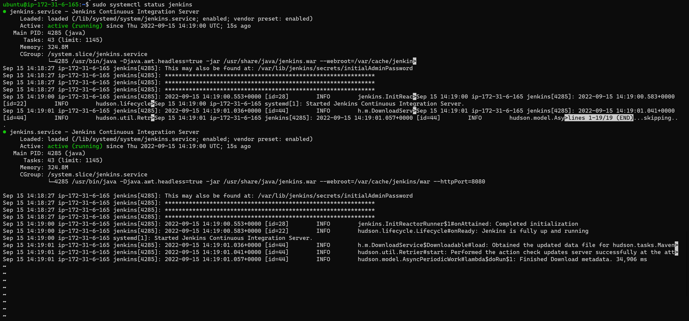

# Project-9

# Continous Integration Pipeline For Tooling Website

## Install Jenkins server

Create an AWS EC2 server based on Ubuntu Server 20.04 LTS and name it "Jenkins"

Then create a new Inbound Rule in your EC2 Security Group. open up port 8080 because that is what Jenkins use. 


Connect to the Instances via your terminal

`sudo apt update`

`sudo apt install default-jdk-headless`

Install the jenkins, copy the code underneath and run  it

```
wget -q -O - https://pkg.jenkins.io/debian-stable/jenkins.io.key | sudo apt-key add -
sudo sh -c 'echo deb https://pkg.jenkins.io/debian-stable binary/ > \
    /etc/apt/sources.list.d/jenkins.list'
sudo apt update
sudo apt-get install jenkins
```

Then confim whether jenkins is now running

`sudo systemctl status jenkins`



Perform the initail jenkins Setup via browser by going to the <public-ip-address of server>:8080


Retrieve the Initial Administrative Password from the terminal to the server

`sudo cat /var/lib/jenkins/secrets/initialAdminPassword`

Type in the Password gotten from the above line of command 


Then Install the Suggested Pluggins


## Configure Jenkins to retrieve source codes from GitHub using Webhooks

### Enable webhooks in your GitHub repository settings


### Go to Jenkins web console, click "New Item" and create a "Freestyle project"

Create a New Item, name it Project 9 and select a Freestyle Project


In configuration of your Jenkins freestyle project choose Git repository, provide there the link to your Tooling GitHub repository and credentials (user/password) so Jenkins could access files in the repository. 


Save the configuration and  run the build by clicking on the Build Now. A number with Green colour shows that it is successful


Open the build and check in "Console Output" if it has run successfully


### Click "Configure" your job/project and add these two configurations

Configure triggering the job from GitHub webhook


Configure "Post-build Actions" to archive all the files – files resulted from a build are called "artifacts"


Now, go ahead and make some change in any file in your GitHub repository. Then come back to the Jenkins Console, You will notice that another build is up. Then check the Console Output for status


Then on the Server, you can check the archive of the build with this command 

`ls /var/lib/jenkins/jobs/project9/builds/<build_number>/archive/`


## Configure Jenkins to copy files to NFS server via SSH

### Install "Publish Over SSH" plugin.

On main dashboard select "Manage Jenkins" and choose "Manage Plugins" menu item. Then on the availabe, search for the Publish Over SSH and then install it


### Configure the job/project to copy artifacts over to NFS server

On main dashboard select "Manage Jenkins" and choose "Configure System" menu item. 

Scroll down to Publish over SSH plugin configuration section and configure it to be able to connect to your NFS server

Supply your Private Key and other info as stated in the diagram below.


Then save the configuration, open your Jenkins job/project configuration page and add another one "Post-build Action"


Configure it to send all files probuced by the build into our previouslys define remote directory. In our case we want to copy all files and directories – so we use **


Save this configuration and go ahead, change something in README.MD file in your GitHub Tooling repository.

This Build will fail because of the permission of owner of the directories on the NFS Server. So you have to log into your NFS Server terminal and change the permission

`sudo chown -R nobody:nobody /mnt`

`sudo chmod -R 777 /mnt`


Then Click on the Build Now on the Jenkins Then it will record Success and confirm through the Console Output


Then Confirm from the Terminal Whether it actually copy the files from the Github to the Directories

