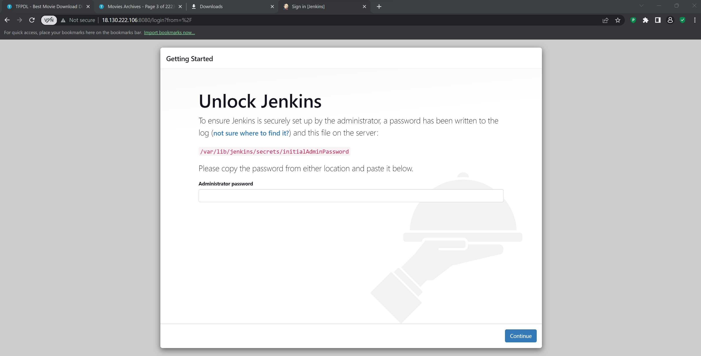

# Project-9

# Continous Integration Pipeline For Tooling Website

## Install Jenkins server

Create an AWS EC2 server based on Ubuntu Server 20.04 LTS and name it "Jenkins"

Then create a new Inbound Rule in your EC2 Security Group. open up port 8080 because that is what Jenkins use. 


Connect to the Instances via your terminal

`sudo apt update`

`sudo apt install default-jdk-headless`

Install the jenkins, copy the code underneath and run  it

```
wget -q -O - https://pkg.jenkins.io/debian-stable/jenkins.io.key | sudo apt-key add -
sudo sh -c 'echo deb https://pkg.jenkins.io/debian-stable binary/ > \
    /etc/apt/sources.list.d/jenkins.list'
sudo apt update
sudo apt-get install jenkins
```

Then confim whether jenkins is now running

`sudo systemctl status jenkins`


Perform the initail jenkins Setup via browser by going to the <public-ip-address of server>:8080



Retrieve the Initial Administrative Password from the terminal to the server

`sudo cat /var/lib/jenkins/secrets/initialAdminPassword`

Type in the Password gotten from the above line of command 


Then Install the Suggested Pluggins


## Configure Jenkins to retrieve source codes from GitHub using Webhooks